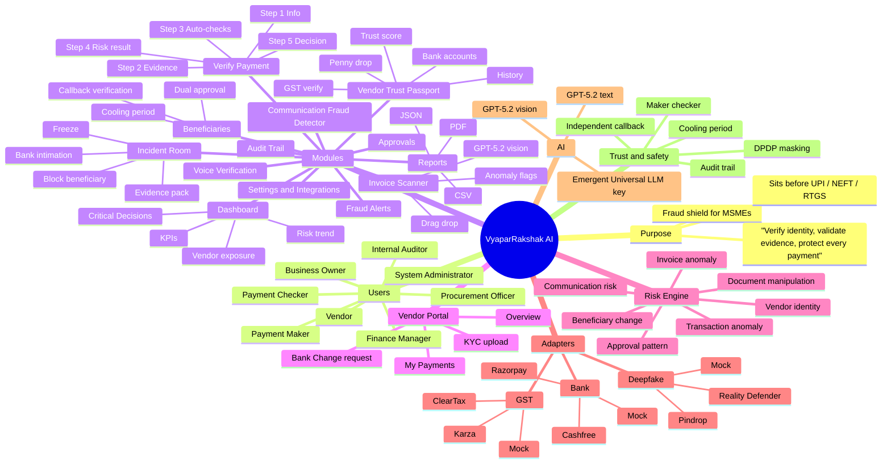
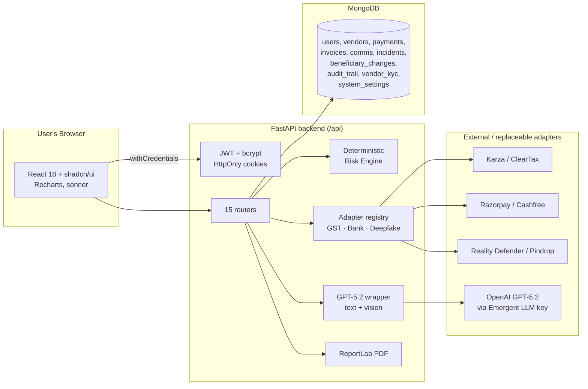
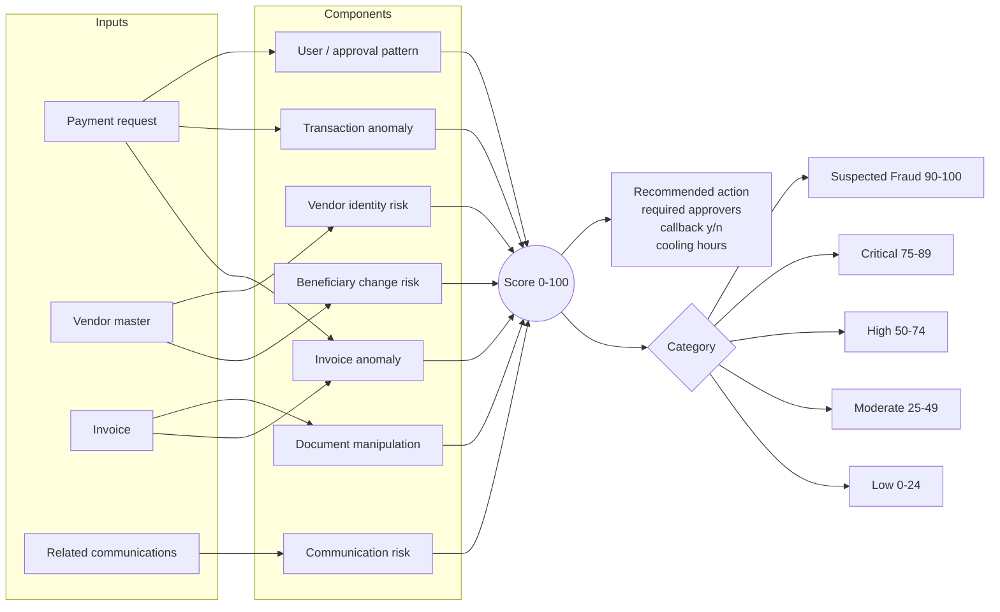
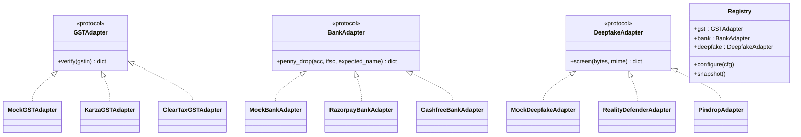
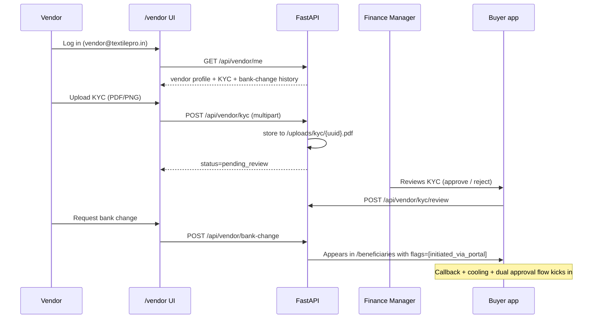

# VyaparRakshak AI — Verify Before You Pay

> **Verify identity. Validate evidence. Protect every payment.**

VyaparRakshak AI is a production-grade **payment-verification and fraud-prevention layer for Indian MSMEs**. It sits between your finance team and every UPI / IMPS / NEFT / RTGS you release, and stops fraud that today drains lakhs from Indian textile mills, machinery traders, packaging vendors, transport contractors and exporters — before the money leaves.

It is built for the way Indian MSMEs *actually* work today — invoices over email, approvals over WhatsApp, callbacks on personal phones, and cash-flow decisions made on the shop floor.

---

## Table of contents

1. [Why this exists](#why-this-exists)
2. [Mind map](#mind-map)
3. [System architecture](#system-architecture)
4. [Feature map](#feature-map)
5. [Roles &amp; access control](#roles--access-control)
6. [Fraud risk engine](#fraud-risk-engine)
7. [Replaceable adapters](#replaceable-adapters)
8. [Vendor self-service portal](#vendor-self-service-portal)
9. [Reports &amp; PDF exports](#reports--pdf-exports)
10. [Tech stack](#tech-stack)
11. [Project layout](#project-layout)
12. [Environment variables](#environment-variables)
13. [Running locally](#running-locally)
14. [Seeded demo data &amp; credentials](#seeded-demo-data--credentials)
15. [Demo storyline (2 minutes)](#demo-storyline-2-minutes)
16. [API reference](#api-reference)
17. [Testing](#testing)
18. [Security &amp; compliance](#security--compliance)
19. [Roadmap](#roadmap)

---

## Why this exists

Indian MSMEs lose money to a very specific pattern of fraud:

- A **vendor's email** is compromised and the fraudster asks for a "new" bank account.
- A **WhatsApp message** impersonates the CEO and demands an "urgent, confidential" transfer.
- The **same invoice** is submitted twice with slightly different numbers.
- A **deepfake voice note** on WhatsApp gives payment instructions.
- A **look-alike domain** (`kirloskarmt.c0.in` instead of `kirloskarmt.co.in`) escapes a busy finance manager.

VyaparRakshak inspects every payment against these patterns, produces an **explainable risk score 0–100**, and refuses to let an AI approve payments autonomously — humans stay in the loop, backed by a maker-checker workflow, independent callback, cooling period and an immutable-looking audit trail.

---

## Mind map



---

## System architecture



---

## Feature map

```mermaid
flowchart TB
    A[VyaparRakshak AI]

    A --> B[Executive Dashboard]
    B --> B1[10 KPI tiles]
    B --> B2["Today's Critical Decisions carousel"]
    B --> B3[Risk mix pie · risk trend line · vendor exposure bar]

    A --> C[Verify Payment · 5 steps]
    C --> C1[Payment info]
    C --> C2[Evidence upload · 9 kinds]
    C --> C3[10 automated checks]
    C --> C4[Explainable red flags + component contributions]
    C --> C5[Decision · approve / hold / reject / fraud + callback]

    A --> D[Smart Invoice Scanner]
    D --> D1[GPT-5.2 vision OCR]
    D --> D2[Anomaly detection · duplicate, GST mismatch, changed bank, arithmetic]

    A --> E[Vendor Trust Passport]
    E --> E1[Trust score 0-100]
    E --> E2[One-click GST verify via adapter]
    E --> E3[Per-account penny-drop via adapter]
    E --> E4[Blocked / watchlist]

    A --> F[Beneficiary bank-change control]
    F --> F1[Independent callback verification]
    F --> F2[Cooling period]
    F --> F3[Dual approval]

    A --> G[Communication Fraud Detector]
    G --> G1[Paste email / WhatsApp / SMS]
    G --> G2[GPT-5.2 + rule engine]
    G --> G3[Inline phrase highlighting]

    A --> H[Voice / Video Verification]
    H --> H1[Advisory synthetic-media score]
    H --> H2[Adapter · Mock / Reality Defender / Pindrop]

    A --> I[Fraud Incident Room]
    I --> I1[Timeline · people · evidence]
    I --> I2[Freeze · Block beneficiary · Escalate]
    I --> I3[Auto-generated bank intimation .txt]
    I --> I4[Downloadable JSON evidence pack]

    A --> J[Vendor Portal]
    J --> J1[Overview & trust]
    J --> J2[KYC upload · 7 kinds · review workflow]
    J --> J3[My Payments status]
    J --> J4[Bank Change request]

    A --> K[Reports]
    K --> K1[8 report types]
    K --> K2[JSON · CSV · PDF export]

    A --> L[Audit Trail]
    A --> M[Settings · Integrations · DPDP]
```



---

## Roles &amp; access control

| Role | Landing screen | Can do | Cannot do |
|---|---|---|---|
| **Business Owner** | Dashboard | Everything, plus approve high-risk payments | Approve their own submissions |
| **Finance Manager** | Dashboard | Approve, hold, review KYC, review beneficiary changes | Approve payments they submitted |
| **Payment Maker** | Dashboard | Create / submit payment requests, upload evidence | Approve any payment |
| **Payment Checker** | Dashboard | Approve, request callback, escalate | Create payments (and then approve them) |
| **Procurement Officer** | Dashboard | Onboard vendors, PO / GRN matching, KYC review | Approve payments above threshold |
| **Internal Auditor** | Audit Trail | Read-only access to everything | Any write action |
| **Vendor** | `/vendor` portal | Upload own KYC, view own payments, request bank change | Access buyer app / dashboard |
| **System Administrator** | Dashboard + Integrations | Manage users, integrations, adapters | (Kept out of financial approvals by policy) |

**Maker-checker separation is enforced at the API level** — `POST /api/payments/{id}/decision` with `decision=approve` on a payment where `submitted_by == current_user` returns `HTTP 409`.

---

## Fraud risk engine



The engine is **transparent and explainable**: every red flag has a `title`, `severity`, `category` and a plain-English `reason`. Generative AI is used only to *explain* red flags and *analyse text signals* — it can **never** approve or reject a payment on its own.

---

## Replaceable adapters

All external verification services are wrapped in **protocol adapters** so the same business code works whether you are in a demo (mock) or in production (real provider). Providers are hot-swapped from the admin **Integrations** screen at `/integrations`.



Every mock response carries `simulated: true` and a `note` field, so the UI can honestly warn the user that external checks are not live yet. To switch to production: open **Settings → Integrations**, choose provider, paste API keys, click **Save**. No code changes required.

---

## Vendor self-service portal

A separate mini-app under `/vendor` that vendor users see instead of the buyer dashboard.



---

## Reports &amp; PDF exports

Every report is available in three formats. Add `?format=pdf` to any report endpoint to get a branded ReportLab PDF with letterhead, Indian rupee grouping (₹18,75,000), page numbers and a footer.

| Report | Endpoint |
|---|---|
| Daily fraud-risk summary | `GET /api/reports/daily-risk` |
| Payments held &amp; released | `GET /api/reports/payments-held` |
| Vendor bank-account changes | `GET /api/reports/bank-changes` |
| Duplicate invoices | `GET /api/reports/duplicate-invoices` |
| High-risk approvers | `GET /api/reports/high-risk-approvers` |
| Potential loss prevented | `GET /api/reports/loss-prevented` |
| Incident ageing | `GET /api/reports/incident-ageing` |
| Vendor risk movement | `GET /api/reports/vendor-risk-movement` |

Each accepts `?format=pdf` for a branded PDF or returns JSON by default. The frontend Reports page also exports CSV client-side.

---

## Tech stack

**Backend**
- Python 3.11, FastAPI, Motor (async MongoDB), Pydantic v2
- JWT (PyJWT) + bcrypt · HttpOnly `Secure` + `SameSite=None` cookies
- `emergentintegrations` for GPT-5.2 text + vision (via Emergent Universal LLM key)
- `httpx` for adapter calls
- `reportlab` for PDF generation

**Frontend**
- React 18 · React Router v6
- shadcn/ui components (Radix + Tailwind CSS)
- Recharts (charts) · lucide-react (icons) · sonner (toasts)
- Custom cybersecurity dark theme · Outfit + IBM Plex Sans + IBM Plex Mono

**Infra (in this pod)**
- Supervisor manages `frontend` (port 3000) and `backend` (port 8001)
- MongoDB local
- Kubernetes ingress rewrites `/api/*` → backend, everything else → frontend

---

## Project layout

```
/app
├── backend
│   ├── server.py                # FastAPI app, /api router, startup hooks
│   ├── auth.py                  # JWT login/register/logout, seed users
│   ├── deps.py                  # get_db, get_current_user, RBAC helpers
│   ├── risk_engine.py           # Deterministic score_payment(), analyse_comms()
│   ├── ai_service.py            # GPT-5.2 text + vision wrapper
│   ├── pdf_service.py           # ReportLab shared report template
│   ├── audit.py                 # Audit trail helper
│   ├── seed.py                  # 6 vendors, 30+ payments, incident, KYC
│   ├── adapters
│   │   ├── base.py              # Protocol interfaces
│   │   ├── gst.py               # Mock, Karza, ClearTax
│   │   ├── bank.py              # Mock, Razorpay, Cashfree
│   │   ├── deepfake.py          # Mock, Reality Defender, Pindrop
│   │   └── registry.py          # Singleton, configure(), snapshot()
│   ├── routers
│   │   ├── dashboard.py         # /dashboard/summary
│   │   ├── vendors.py           # /vendors + /verify-gst + /verify-bank
│   │   ├── payments.py          # /payments + /decision + /callback + /rerun-risk
│   │   ├── invoices.py          # /invoices/scan (GPT-5.2 vision)
│   │   ├── beneficiaries.py     # /beneficiary-changes + /decision
│   │   ├── incidents.py         # /incidents + /action + /evidence-pack
│   │   ├── comms.py             # /comms/analyze
│   │   ├── voice.py             # /voice/analyze (uses deepfake adapter)
│   │   ├── audit.py             # /audit
│   │   ├── reports.py           # 8 reports · JSON + PDF
│   │   ├── approvals.py         # /approvals/queue
│   │   ├── notifications.py     # /notifications
│   │   ├── vendor_portal.py     # /vendor/me + /kyc + /bank-change + /payments
│   │   └── settings.py          # /settings/integrations (GET/PUT/test)
│   ├── tests
│   │   ├── backend_test.py         # 25 iter-1 regression tests
│   │   └── backend_iter2_test.py   # 30 iter-2 tests
│   ├── uploads/kyc              # Local disk storage for KYC uploads
│   ├── requirements.txt
│   └── .env
│
├── frontend
│   ├── package.json
│   └── src
│       ├── App.js               # Router · RoleRoot auto-redirects vendor
│       ├── index.css            # Dark theme · Outfit + IBM Plex + risk badge palette
│       ├── lib
│       │   ├── api.js           # axios http + REACT_APP_BACKEND_URL
│       │   ├── format.js        # formatINR, fromNow, maskAccount, RISK_LABEL
│       │   └── AuthContext.jsx  # login / logout / me
│       ├── components
│       │   ├── Layout.jsx           # Buyer app sidebar + top ribbon
│       │   ├── VendorLayout.jsx     # Vendor portal shell
│       │   ├── ProtectedRoute.jsx
│       │   ├── RiskBadge.jsx        # 5 categories
│       │   └── KPICard.jsx
│       └── pages
│           ├── Login.jsx
│           ├── Dashboard.jsx
│           ├── VerifyPayment.jsx        (5-step)
│           ├── PaymentDetail.jsx
│           ├── InvoiceScanner.jsx
│           ├── Vendors.jsx + VendorDetail.jsx
│           ├── Beneficiaries.jsx
│           ├── Approvals.jsx
│           ├── FraudAlerts.jsx
│           ├── IncidentRoom.jsx + IncidentDetail.jsx
│           ├── CommDetector.jsx
│           ├── VoiceVerification.jsx
│           ├── Reports.jsx              (JSON + CSV + PDF)
│           ├── AuditTrail.jsx
│           ├── Settings.jsx
│           ├── Integrations.jsx         (admin only)
│           └── vendor
│               ├── VendorHome.jsx
│               ├── VendorKyc.jsx
│               ├── VendorPayments.jsx
│               └── VendorBankChange.jsx
│
├── memory
│   ├── PRD.md                   # Product requirements + running history
│   └── test_credentials.md      # Seeded credentials
├── auth_testing.md
├── image_testing.md
├── design_guidelines.json       # Design agent output
└── README.md                    # (this file)
```

---

## Environment variables

**Backend (`/app/backend/.env`)** — never edit protected keys, only add.

| Key | Purpose |
|---|---|
| `MONGO_URL` | Local Mongo connection string |
| `DB_NAME` | `vyaparrakshak` |
| `CORS_ORIGINS` | `*` for the prototype |
| `JWT_SECRET` | HS256 signing key for access + refresh tokens |
| `ADMIN_EMAIL` / `ADMIN_PASSWORD` | Bootstrap admin credentials for seed |
| `EMERGENT_LLM_KEY` | Universal key for GPT-5.2 (text + vision) via emergentintegrations |
| `FRONTEND_URL` | Preview URL (informational) |
| `UPLOAD_DIR` *(optional)* | Where KYC files are stored, default `/app/backend/uploads/kyc` |

**Frontend (`/app/frontend/.env`)**

| Key | Purpose |
|---|---|
| `REACT_APP_BACKEND_URL` | Base URL — the frontend calls `${REACT_APP_BACKEND_URL}/api/...` |

---

## Running locally

Both services are already managed by Supervisor in this pod. If you edit code, hot reload picks it up. If you edit `.env` or install a dependency, restart the corresponding service:

```bash
sudo supervisorctl restart backend
sudo supervisorctl restart frontend
```

Install new backend packages via `pip install ...` then `pip freeze > /app/backend/requirements.txt`. Install new frontend packages via `yarn add ...` (never `npm`).

---

## Seeded demo data &amp; credentials

All seeded users share password `Owner@123`.

| Role | Email |
|---|---|
| System Administrator | `admin@vyaparrakshak.in` |
| Business Owner | `owner@vyaparrakshak.in` |
| Finance Manager | `finance@vyaparrakshak.in` |
| Payment Maker | `maker@vyaparrakshak.in` |
| Payment Checker | `checker@vyaparrakshak.in` |
| Procurement Officer | `procurement@vyaparrakshak.in` |
| Internal Auditor | `auditor@vyaparrakshak.in` |
| Vendor | `vendor@textilepro.in` |

Seeded on first startup (idempotent):

- **6 vendors** — TextilePro Mills, Kirloskar Machinery, Bansal Packaging, Sundaram Transport, Prakash CA, Nordic Exports
- **30+ payments** covering normal, duplicate, GST-mismatch, fake bank change, CEO impersonation, weekend, split-below-threshold
- **1 pending beneficiary change** for Kirloskar (the demo storyline)
- **1 open incident** `INC-2026-0117` linked to the ₹18,75,000 machinery payment
- **1 approved KYC document** for TextilePro Mills

---

## Demo storyline (2 minutes)

1. Log in as **Business Owner** (`owner@vyaparrakshak.in / Owner@123`).
2. On the dashboard, "**Today's Critical Decisions**" shows a **₹18,75,000 Kirloskar Machinery Traders** payment marked **Critical**.
3. Click **Review evidence**. The Payment Detail page explains, in plain English, every red flag:
   - Bank account changed today
   - Sender email domain has an altered character (`kirloskarmt.c0.in`)
   - Amount is over 3× vendor's historical average
   - WhatsApp message asks finance not to call
   - Invoice number resembles a previously paid invoice
   - Independent callback incomplete
4. Fill the **Independent callback** form using the *previously verified* number from the Vendor Trust Passport — record result.
5. Click **Hold** or **Report fraud** → an incident opens (or `INC-2026-0117` is already there).
6. Open **Incident Room → INC-2026-0117** → click **Generate bank intimation** to download a pre-drafted letter to the cyber-fraud cell, and **Evidence pack** for the full JSON dossier.
7. Switch to the **Vendor Portal** by logging out and logging back in as `vendor@textilepro.in`. The vendor sees only their trust score, KYC state, own payments and bank-change request form.

---

## API reference

All endpoints are prefixed with `/api`. Auth uses JWT in `HttpOnly Secure SameSite=None` cookies (`access_token` + `refresh_token`). Send `withCredentials: true` (axios) or `credentials: 'include'` (fetch).

### Auth
```
POST /api/auth/register
POST /api/auth/login
POST /api/auth/logout
POST /api/auth/refresh
GET  /api/auth/me
GET  /api/auth/users
```

### Dashboard &amp; notifications
```
GET /api/dashboard/summary
GET /api/notifications
```

### Payments &amp; verification
```
GET  /api/payments?status=&category=&q=&page=&limit=
GET  /api/payments/{id}
POST /api/payments
POST /api/payments/{id}/decision       # enforces maker-checker
POST /api/payments/{id}/callback
POST /api/payments/{id}/rerun-risk
GET  /api/approvals/queue
```

### Invoices
```
GET  /api/invoices
POST /api/invoices/scan                # multipart, PNG/JPEG/WebP, GPT-5.2 vision
GET  /api/invoices/scans
```

### Vendors
```
GET  /api/vendors
GET  /api/vendors/{id}
POST /api/vendors
POST /api/vendors/{id}/block
POST /api/vendors/{id}/verify-gst      # adapter
POST /api/vendors/{id}/verify-bank     # adapter, penny-drop
```

### Beneficiaries
```
GET  /api/beneficiary-changes
GET  /api/beneficiary-changes/{id}
POST /api/beneficiary-changes
POST /api/beneficiary-changes/{id}/decision
```

### Communications, voice, incidents
```
POST /api/comms/analyze                # GPT-5.2 + rule engine
GET  /api/comms

POST /api/voice/analyze                # deepfake adapter
GET  /api/voice

GET  /api/incidents
GET  /api/incidents/{id}
POST /api/incidents
POST /api/incidents/{id}/action        # freeze / block_beneficiary / notify_bank / assign / escalate / close
GET  /api/incidents/{id}/evidence-pack
```

### Reports (each supports `?format=pdf`)
```
GET /api/reports/daily-risk
GET /api/reports/payments-held
GET /api/reports/bank-changes
GET /api/reports/duplicate-invoices
GET /api/reports/high-risk-approvers
GET /api/reports/loss-prevented
GET /api/reports/incident-ageing
GET /api/reports/vendor-risk-movement
```

### Audit
```
GET /api/audit?entity_type=&entity_id=&user_role=&action=&q=&page=&limit=
```

### Vendor portal
```
GET  /api/vendor/me
GET  /api/vendor/payments
POST /api/vendor/kyc                   # multipart, kind/notes/file
POST /api/vendor/bank-change
GET  /api/vendor/kyc/all                # buyer-side review list
POST /api/vendor/kyc/review             # buyer-side approve / reject
```

### Settings &amp; integrations (admin/owner only)
```
GET  /api/settings/integrations         # returns { config (masked), snapshot }
PUT  /api/settings/integrations
POST /api/settings/integrations/test/{gst|bank|deepfake}
```

---

## Testing

Two pytest files under `/app/backend/tests/`:

- `backend_test.py` — 25 iteration-1 regression tests (auth, RBAC, dashboard, payments, invoices, vendors, beneficiaries, incidents, comms, voice, audit, reports).
- `backend_iter2_test.py` — 30 iteration-2 tests (adapters, settings/integrations, vendor portal, PDF exports, VendorDetail verify-gst/verify-bank).

Run them all against the preview environment:

```bash
REACT_APP_BACKEND_URL=https://vyapar-shield.preview.emergentagent.com \
  pytest -o addopts= backend/tests/
```

Current status: **55 / 55 passing**.

---

## Security &amp; compliance

- **Passwords** hashed with bcrypt · brute-force lockout after 5 failed logins in 15 min.
- **JWT** access token (8 hours) + refresh token (7 days) in HttpOnly Secure SameSite=None cookies.
- **Maker-checker** separation enforced at API level with `HTTP 409`.
- **Audit trail** captures user, timestamp, device, IP, action, previous value, new value, reason and evidence reference for every write action.
- **DPDP posture** — settings screen exposes data-retention days, consent flag, deletion request; the code masks account numbers and PAN in list views when `mask_pii=true`.
- **AI never approves** — LLM outputs are advisory only. Payments always require a human decision with a written reason.
- **Adapters clearly labelled** — mock responses always carry `simulated: true`; the Integrations screen shows a live-vs-mock status chip per provider.

---

## Roadmap

**P1 (next up)**
- Wire real provider keys: Karza / ClearTax (GST), Razorpay / Cashfree (bank), Reality Defender / Pindrop (deepfake).
- Vendor Onboarding Wizard — paste GSTIN → auto-verified passport + email vendor a portal invite via Resend.
- Notifications via Resend + WhatsApp Business API (callback prompts, KYC review outcomes).
- Move KYC + evidence uploads to Emergent Object Storage.
- Multi-tenant / multi-org (org-scoped queries + per-org RBAC).

**P2**
- ML-based anomaly detection over historical payments (Isolation Forest / Prophet).
- ERP connectors — Tally, Zoho Books, Vyapar app.
- Digital signatures on incident evidence packs (DocuSign / eMudhra).
- SSO for buyer admins via Emergent Google Auth.

---

*Built for Indian MSMEs. Deployed on Emergent. Every rupee inspected before it moves.*
